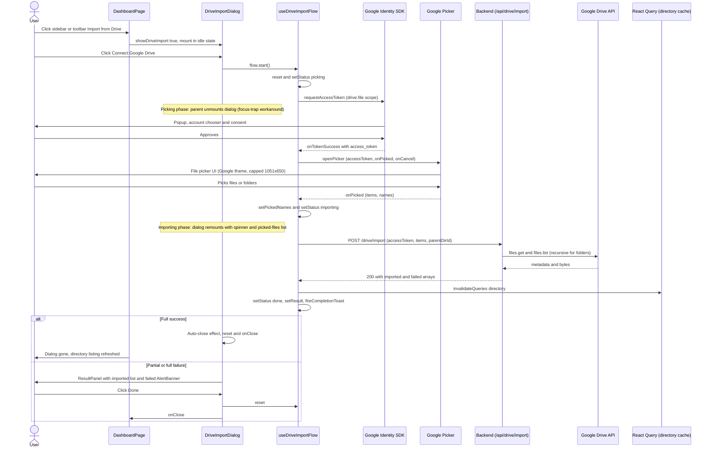

# Google Drive Import Flow

## Table of Contents

1. [Overview](#1-overview)
2. [Architecture overview](#2-architecture-overview)
3. [The import flow](#3-the-import-flow)
4. [State machine](#4-state-machine)
5. [Design decisions](#5-design-decisions)
6. [Google Cloud setup](#6-google-cloud-setup)
7. [Edge cases and error handling](#7-edge-cases-and-error-handling)
8. [Glossary](#8-glossary)

---

## 1. Overview

TroveCloud lets authenticated users import files and folders from their Google Drive into the current TroveCloud directory. The user picks items via Google's official file Picker, the frontend hands the picked IDs + a short-lived access token to the backend, and the backend streams the bytes from Drive into TroveCloud's storage. The user never uploads anything from their browser — the heavy lifting happens server-to-server.

| Aspect           | Value                                                                         |
| ---------------- | ----------------------------------------------------------------------------- |
| Trigger surfaces | Sidebar `+ New` dropdown, directory toolbar Drive icon                        |
| Provider         | Google Drive via Google Identity Services (GIS) + Google Picker SDK           |
| OAuth scope      | `https://www.googleapis.com/auth/drive.file` (per-item access, non-sensitive) |
| Backend endpoint | `POST /api/drive/import` (single round-trip, partial-success contract)        |
| Status           | ✅ Live — SDK plumbing PR #46, dialog UI PR #47                               |

This document covers the full flow — the architecture, the state machine inside `useDriveImportFlow`, the design decisions (why we conditionally unmount during picking, why we auto-close on full success, why `setAppId` is mandatory), the one-time Google Cloud setup ritual, and the edge cases each piece handles.

---

## 2. Architecture overview

### 2.1 Layers

```
DashboardPage (owns flow state)
  └── useDriveImportFlow              (orchestration hook)
       ├── useGoogleLogin             (token request via GIS, drive.file scope)
       ├── openPicker                 (Google Picker SDK loader + invocation)
       ├── useDriveImport             (React Query mutation wrapper)
       └── fireCompletionToast        (toast variant by outcome)
  └── DriveImportDialog               (parent-conditionally mounted shell)
       ├── DriveImportBody            (state-switched body)
       │    ├── IdleState
       │    ├── ImportingState
       │    └── ResultPanel
       └── DriveImportFooter          (state-switched buttons)
```

### 2.2 File layout

| Layer              | File                                                          | Role                                                                                                                                               |
| ------------------ | ------------------------------------------------------------- | -------------------------------------------------------------------------------------------------------------------------------------------------- |
| Picker SDK loader  | `src/lib/googlePicker.ts`                                     | Idempotent script loader (`loadPickerApi`); `openPicker` builds + shows the Picker. Owns `setAppId`, viewport sizing, and the cached load promise. |
| API call           | `src/api/drive.api.ts`                                        | `importFromDrive({ accessToken, items, parentDirId })` posts to `/drive/import`.                                                                   |
| Mutation hook      | `src/hooks/useDriveImport.ts`                                 | Thin `useMutation({ mutationFn: importFromDrive })` wrapper.                                                                                       |
| Orchestration hook | `src/hooks/useDriveImportFlow.ts`                             | The brain. Owns the state machine, GIS token flow, picker invocation, mutation outcomes, error-code mapping, and the completion-toast logic.       |
| Types              | `src/types/drive.types.ts`                                    | `DriveImportPayload`, `DriveImportResult`, `DrivePickedItem`, `DriveImportedItem`, `DriveFailedItem`, `DriveImportFailureReason` (5-code union).   |
| Dialog shell       | `src/components/dashboard/dialogs/DriveImportDialog.tsx`      | Parent-conditionally mounted Radix Dialog. Owns mount-time reset, auto-close-on-full-success, and close-mid-import semantics.                      |
| Body               | `src/components/dashboard/drive-import/DriveImportBody.tsx`   | Renders the right body sub-component for each state. Owns `FAILURE_REASON_LABELS`.                                                                 |
| Footer             | `src/components/dashboard/drive-import/DriveImportFooter.tsx` | State-driven button row (Done / Try again / Cancel / Close).                                                                                       |
| Brand icon         | `src/components/icons/DriveIcon.tsx`                          | Inline-SVG Drive logo, `currentColor`-aware. Shared by sidebar dropdown, toolbar, and dialog idle state.                                           |
| Sidebar trigger    | `src/components/dashboard/sidebar/SidebarNewButton.tsx`       | Dispatches `"import-from-drive"` custom event.                                                                                                     |
| Toolbar trigger    | `src/components/dashboard/directory/DirectoryToolbar.tsx`     | Calls `onImportFromDrive` prop.                                                                                                                    |
| Trigger handling   | `src/hooks/useSidebarActions.ts`                              | Listens for the custom event, manages `showDriveImport` state.                                                                                     |

### 2.3 Where state lives

The flow object returned by `useDriveImportFlow` is instantiated **in `DashboardPage`**, not the dialog. This matters because the dialog uses parent-conditional mount — it unmounts and remounts during the flow (most notably during the `picking` state). The flow state needs to outlive the dialog so the dialog can rejoin a flow already in progress.

```ts
// DashboardPage.tsx
const driveImportFlow = useDriveImportFlow({ parentDirId: dirId });
// ...
{showDriveImport && driveImportFlow.status !== "picking" && (
  <DriveImportDialog flow={driveImportFlow} onClose={handleCloseDriveImport} />
)}
```

---

## 3. The import flow

### 3.1 Sequence diagram



### 3.2 Step-by-step walkthrough

**Step 1 — Trigger.**
The user clicks the Drive icon in the directory toolbar (calls `onImportFromDrive` prop, which calls `setShowDriveImport(true)`) or the "Import from Drive" item in the sidebar `+ New` dropdown (dispatches a `"import-from-drive"` custom event captured by `useSidebarActions`). Both paths flip `showDriveImport` to `true`.

**Step 2 — Dialog mounts in idle state.**
`{showDriveImport && status !== "picking" && <DriveImportDialog ... />}` — `status` is `"idle"` on first mount, so the dialog renders. `DriveImportBody` dispatches to `IdleState`, which shows a brand-purple Drive icon in a circle and the "Connect Google Drive" button.

**Step 3 — User clicks Connect.**
`flow.start()` runs:

1. `reset()` clears any leftover state (status → idle, error → null, result → null, pickedNames → {}, isBackgroundRef → false).
2. `setStatus("picking")` — schedules the state transition.
3. `requestAccessToken()` — function returned by `useGoogleLogin({ flow: "implicit", scope: "drive.file" })`. Opens the Google sign-in popup.

After re-render, `status === "picking"` triggers `DashboardPage`'s conditional unmount. The dialog unmounts. The Google popup is now over the dashboard with no dialog underneath.

**Step 4 — Token granted.**
User authenticates in the Google popup and consents to the `drive.file` scope. GIS fires `onTokenSuccess({ access_token })`. The hook's handler:

1. Guards against missing `access_token` (would set error and return).
2. Calls `openPicker({ accessToken, onPicked, onCancel })` — this awaits.

**Step 5 — Picker opens.**
`openPicker` first awaits `loadPickerApi()` (idempotent script loader for `https://apis.google.com/js/api.js` + `gapi.load("picker")`). On first call this loads the SDK; subsequent calls resolve immediately from cache. Then it builds the Picker with:

- `setOAuthToken(accessToken)` — the user's token.
- `setDeveloperKey(VITE_GOOGLE_API_KEY)` — the API key.
- `setAppId(<project-number>)` — derived from `GOOGLE_CLIENT_ID`'s numeric prefix. **This is mandatory** for `drive.file` scope to grant the app read access to picked items (see §5.4).
- `.setSize(width, height)` — capped at 1051×650 (Google's recommended default), scales down on smaller viewports.
- `.enableFeature(MULTISELECT_ENABLED)` — multi-pick.

`picker.setVisible(true)` opens the Picker iframe.

**Step 6 — User picks items.**
The user selects files and/or folders and clicks Select. Picker fires the callback with `{ action: "PICKED", docs: [{ id, mimeType, name }, ...] }`. The hook:

1. Maps `docs` to `items: [{id, mimeType}]` — the contract the backend expects.
2. Builds a `names: { driveId → name }` map — a fallback for failed-item identification (see §5.5).
3. Calls `onPicked(accessToken, items, names)`.

If the user clicks Cancel in the Picker, `{ action: "CANCEL" }` fires, `onCancel` runs, `setStatus("idle")` — dialog remounts in idle state.

**Step 7 — Mutation fires.**
`onPicked` (in the hook):

1. Guards against empty `items` (rare — happens if user clicks Select with nothing chosen). `setStatus("idle")` and return.
2. `setPickedNames(names)` — stored on the flow for the result panel's name fallback.
3. `setStatus("importing")` — dialog remounts (status no longer `"picking"`), now showing the spinner + picked-files list.
4. `runImport({ accessToken, items, parentDirId }, { onSuccess, onError })` — fires the React Query mutation, which calls `axiosClient.post("/drive/import", payload)`.

**Step 8 — Backend processes.**
The backend receives the request, fetches each item's metadata from Drive, recurses into folders (up to depth 20), streams bytes from Drive to TroveCloud's storage, applies caps (100 MB/file, 500 MB/request), and returns `200 { imported: [...], failed: [...] }`. Always 200 — partial-success is the model. Top-level errors (`INVALID_DRIVE_TOKEN`, `INVALID_INPUT`) come back as 4xx and reject the mutation.

**Step 9 — Mutation resolves.**
`onMutationSuccess`:

1. `setResult(data)` — stores the imported/failed arrays.
2. `setStatus("done")`.
3. `queryClient.invalidateQueries({ queryKey: ["directory"] })` — refetches the current directory listing so newly imported items appear.
4. `fireCompletionToast(data, isBackgroundRef.current)` — variant depends on outcome and whether the dialog was open (see §5.3).

**Step 10 — UI completes.**

- **Full success** (`failed.length === 0`): the dialog's auto-close effect detects this on next render, calls `reset()` + `onClose()`, dialog unmounts. User sees only the toast and the refreshed directory listing.
- **Partial / full failure**: dialog stays open, `ResultPanel` renders the imported list (bordered card with file icons) + failed list (inside an `AlertBanner variant="error"` with per-item friendly reason copy from `FAILURE_REASON_LABELS`). User clicks "Done" to close.

### 3.3 Files involved

| Stage                     | File                                                          | Role                                                                                                                                                           |
| ------------------------- | ------------------------------------------------------------- | -------------------------------------------------------------------------------------------------------------------------------------------------------------- |
| App boot                  | `src/main.tsx`                                                | Validates `VITE_GOOGLE_CLIENT_ID` and wraps app in `<GoogleOAuthProvider>` (shared with the OAuth flow)                                                        |
| Constants                 | `src/lib/constants.ts`                                        | `GOOGLE_API_KEY`, `GOOGLE_CLIENT_ID`                                                                                                                           |
| Trigger (sidebar)         | `src/components/dashboard/sidebar/SidebarNewButton.tsx`       | Dispatches `"import-from-drive"` custom event                                                                                                                  |
| Trigger (toolbar)         | `src/components/dashboard/directory/DirectoryToolbar.tsx`     | Calls `onImportFromDrive` prop                                                                                                                                 |
| Trigger handling          | `src/hooks/useSidebarActions.ts`                              | Owns `showDriveImport` state, listens for the custom event                                                                                                     |
| Page integration          | `src/pages/DashboardPage.tsx`                                 | Instantiates `useDriveImportFlow`, parent-conditionally mounts `DriveImportDialog` (skipping the `picking` state), passes a stable `onClose` via `useCallback` |
| Type contracts            | `src/types/drive.types.ts`                                    | All Drive-related shapes                                                                                                                                       |
| API call                  | `src/api/drive.api.ts`                                        | `importFromDrive({...})` posts to `/api/drive/import`                                                                                                          |
| Mutation hook             | `src/hooks/useDriveImport.ts`                                 | `useMutation({ mutationFn: importFromDrive })`                                                                                                                 |
| Orchestration hook        | `src/hooks/useDriveImportFlow.ts`                             | The brain — state machine, GIS token flow, picker invocation, error mapping, completion toast                                                                  |
| Picker SDK                | `src/lib/googlePicker.ts`                                     | `loadPickerApi()` + `openPicker(...)`. Owns `setAppId`, viewport sizing, the cached load promise                                                               |
| Dialog shell              | `src/components/dashboard/dialogs/DriveImportDialog.tsx`      | Parent-conditionally mounted Radix Dialog. Mount-reset, auto-close, close-mid-import semantics                                                                 |
| Body + states             | `src/components/dashboard/drive-import/DriveImportBody.tsx`   | `IdleState`, `ImportingState`, `ResultPanel`, `FAILURE_REASON_LABELS`                                                                                          |
| Footer                    | `src/components/dashboard/drive-import/DriveImportFooter.tsx` | State-driven button layouts                                                                                                                                    |
| Brand icon                | `src/components/icons/DriveIcon.tsx`                          | Inline-SVG, `currentColor`-aware, shared across 3 callers                                                                                                      |
| Format helpers            | `src/lib/formatters.ts`                                       | `pluralize(count, word)` used by counts in headlines                                                                                                           |
| Cache invalidation target | `src/hooks/useDirectoryContents.ts`                           | Reads the `["directory"]` query that gets invalidated post-import                                                                                              |

---

## 4. State machine

The hook exposes five statuses; the dialog renders a different body for each.

| Status      | What's happening                                                                  | Body UI                                                                                                           | Footer                          |
| ----------- | --------------------------------------------------------------------------------- | ----------------------------------------------------------------------------------------------------------------- | ------------------------------- |
| `idle`      | Initial state; nothing in flight                                                  | Drive icon + "Connect Google Drive" button                                                                        | Cancel                          |
| `picking`   | Token request OR Picker is open over our app                                      | (dialog is unmounted by parent — see §5.1)                                                                        | (n/a)                           |
| `importing` | Mutation in flight                                                                | Spinner + headline (`Importing N items from Google Drive…`) + dismissible hint + bordered list of picked files    | Close (signals "background it") |
| `done`      | Mutation completed                                                                | `ResultPanel` — imported list (bordered card) + failed list (`AlertBanner variant="error"` with friendly reasons) | Done                            |
| `error`     | Top-level error (`INVALID_DRIVE_TOKEN`, `INVALID_INPUT`, 5xx, picker SDK failure) | `AlertBanner variant="error"` with friendly message                                                               | Cancel + Try again              |

### 4.1 Transitions

| From        | To          | Trigger                                                                                                 |
| ----------- | ----------- | ------------------------------------------------------------------------------------------------------- |
| `idle`      | `picking`   | `start()` (user clicked Connect)                                                                        |
| `picking`   | `idle`      | User cancelled Google sign-in popup (`popup_closed`); user cancelled Picker                             |
| `picking`   | `importing` | User picked ≥1 items in Picker                                                                          |
| `picking`   | `error`     | OAuth error; non-OAuth error other than `popup_closed`; Picker SDK failed to load; missing access token |
| `importing` | `done`      | Mutation resolved (any outcome — full success / partial / full failure)                                 |
| `importing` | `error`     | Mutation rejected (`INVALID_DRIVE_TOKEN`, `INVALID_INPUT`, 5xx)                                         |
| `done`      | `idle`      | Dialog auto-closed (full success) → mount effect on next open OR explicit `reset()` from Done button    |
| `error`     | `idle`      | Mount effect on next open OR Cancel button                                                              |
| `error`     | `picking`   | Try again button → `start()`                                                                            |

### 4.2 Background flag

`isBackgroundRef` (a `useRef`, not state — toggling it shouldn't re-render) tracks whether the user closed the dialog while `status === "importing"`. It's set to `true` in `handleOpenChange`'s mid-import branch, cleared on the next dialog mount (or on `reset()`). The completion toast uses this flag to decide whether to fire (see §5.3).

---

## 5. Design decisions

The Drive Import flow has six decisions that diverge from the obvious "naive" implementation. Each is documented with the problem and the trade-off.

### 5.1 Conditionally unmount the dialog during `picking`

**Problem.** Radix Dialog uses `react-focus-lock` to trap keyboard + pointer events inside `DialogContent`. The Google Picker iframe renders to a portal mounted on `document.body`, **outside** our React tree. Radix sees the Picker as "outside" and intercepts every event aimed at it. Result: the Picker is visually present but **clicks and scroll don't work** for ~60 seconds (until the focus trap times out).

**Solution.** Parent-conditionally unmount the dialog while `status === "picking"`:

```tsx
// DashboardPage.tsx
{
	showDriveImport && driveImportFlow.status !== "picking" && (
		<DriveImportDialog
			flow={driveImportFlow}
			onClose={handleCloseDriveImport}
		/>
	);
}
```

When the user clicks "Connect Google Drive", `start()` flips status to `"picking"` → React re-renders → conditional fails → dialog unmounts → Radix's focus trap is gone → Picker is fully interactive. When status transitions to `"importing"` (or `"idle"` on cancel), the conditional becomes true again → dialog remounts, picking up the in-progress flow state.

**Trade-off.** The dialog briefly disappears during the Google sign-in popup phase (between status flipping to `"picking"` and the Picker iframe rendering). The dashboard is visible behind the popup — not jarring in practice. The flow state lives in `DashboardPage`, not the dialog, so unmount/remount preserves everything.

### 5.2 Auto-close on full success

**Problem.** The naive UX would show a result panel for every completion: "1 file imported." → user clicks Done → dialog closes. That's two extra clicks for the most common happy-path outcome (single small file imports). The user explicitly asked: _"skip this and directly show the TroveCloud UI where user can verify the imported files. By doing this we can decrease the click of user."_

**Solution.** Auto-close the dialog when the mutation succeeds with no failures:

```tsx
// DriveImportDialog.tsx
useEffect(() => {
	if (status === "done" && result && result.failed.length === 0) {
		reset();
		onClose();
	}
}, [status, result, reset, onClose]);
```

The hook's `fireCompletionToast` always fires a `toast.success` for full success (regardless of background flag) so the user has confirmation. The directory listing already refreshed via the cache invalidation, so the new files appear in the grid behind. Result: one click (pick) → toast + directory updates → done.

The result panel is reserved for partial / full failure cases, where the user genuinely needs to see what failed.

**Trade-off.** Foreground full-success and background completions both rely on the toast for confirmation. Without the toast, full-success users would see no feedback at all (dialog gone, just new files appearing). The toast and the auto-close are coupled — see §5.3.

### 5.3 Background-import support

**Problem.** Drive imports can be slow (large files, recursive folders). A user picking 50 items might wait 30+ seconds. They reasonably want to keep working — close the dialog and let it run. Without a notification, they'd have no signal when it finishes.

**Solution.** When the user closes the dialog mid-import, mark the run as "background" and let the mutation continue. On completion, fire a toast:

```ts
// DriveImportDialog.tsx
const handleOpenChange = (open: boolean) => {
	if (open) return;
	if (status === "importing")
		setBackground(true); // ← here
	else reset();
	onClose();
};
```

```ts
// useDriveImportFlow.ts
const fireCompletionToast = (data, isBackground) => {
  if (data.failed.length === 0) {
    toast.success(...);   // always for full success
    return;
  }
  if (!isBackground) return;   // foreground partial/failure → result panel handles it
  // background partial/failure → toast.warning or toast.error
};
```

The completion toast variant depends on the outcome (success / warning / error). The flag is reset on each fresh dialog mount so a subsequent foreground run doesn't inherit stale state.

### 5.4 `setAppId` is mandatory for `drive.file` scope

**Problem.** First-pass implementation wired the Picker without `setAppId`. Imports succeeded only at the picker-iframe level — every picked file came back as `DRIVE_ITEM_NOT_FOUND` from the backend. The frontend had a working access token, the backend had the right permissions, the API key was valid, and yet Drive's API returned 404 for every picked-item ID.

**Root cause.** Google's `drive.file` scope only grants the _app_ (identified by Cloud project number) access to files the user explicitly picks via the Picker. The Picker associates picked items with an "App ID" which **must be set explicitly** via `setAppId(<projectNumber>)`. Without it, the picker grants access to "no specific app", and the access token (which is tied to _our_ app) can't read the items.

The "App ID" is the **Cloud project number** (numeric), which is the prefix of the OAuth client ID:

```
628815697781-qq60k5gq806bgunr02anfdkrnhcmob2h.apps.googleusercontent.com
^^^^^^^^^^^^
project number / App ID
```

**Solution.** Derive the App ID from the OAuth client ID at runtime — no separate env var needed:

```ts
// googlePicker.ts
const appId = GOOGLE_CLIENT_ID.split("-")[0];
// ...
.setAppId(appId)
```

A code comment explains the requirement and warns against removing the line.

**Trade-off.** Tightly couples the Picker setup to the OAuth client ID format. If Google ever changes the client-ID format, this breaks. Mitigated by a code comment and the fact that the format has been stable for years.

### 5.5 `pickedNames` fallback for failed-item naming

**Problem.** The backend returns `failed[].name = null` in some failure paths (notably `DRIVE_ITEM_NOT_FOUND`, but also some others — see backend tracker `§14`). Without a name, the failed list shows "Unnamed item — File not found or trashed.", which is unhelpful when the user wants to know _which_ file failed so they can re-pick or fix it.

**Solution.** Capture each picked item's name from the Picker callback (we already get it for free in `doc.name`), store as a `Record<driveId, name>` on the flow, and use it as a fallback in the result panel:

```ts
// useDriveImportFlow.ts — capture
setPickedNames(names);

// DriveImportBody.tsx — use as fallback
{
	item.name ?? pickedNames[item.driveId] ?? "Unnamed item";
}
```

Three-step resolution: backend name (best — authoritative post-fetch) → picker name (covers nulls) → "Unnamed item" (final fallback for files inside picked folders that fail before metadata is available).

**Trade-off.** Adds plumbing across 3 files (picker callback now returns `(items, names)`, hook stores `pickedNames` state, dialog passes it through to body). The cleaner long-term fix is the backend `§14` task — populate `name` whenever the metadata fetch returned. The frontend fallback then becomes defense-in-depth for the genuinely-unknowable `DRIVE_ITEM_NOT_FOUND` case.

### 5.6 Picker viewport sizing capped at 1051×650

**Problem.** Without `setSize`, Google's Picker iframe uses default dimensions that **stretch and clip on large monitors** — header and footer fall off-screen, scrolling broken. Worked fine on laptops; broke on 1440p+ monitors.

**Solution.** Compute viewport-aware bounds with a sane cap matching Google's documented default:

```ts
const width = Math.min(window.innerWidth - 64, 1051);
const height = Math.min(window.innerHeight - 64, 650);
.setSize(width, height)
```

The `- 64` provides a 32 px margin per side so the Picker never butts against viewport edges. The 1051×650 cap matches Google's design — going larger doesn't reveal more content, just stretches whitespace.

**Trade-off.** None substantive. Fixed values picked once and frozen.

---

## 6. Google Cloud setup

A correctly-functioning Drive Import requires four pieces of Google Cloud configuration beyond the OAuth client ID already used for sign-in. **Each is a one-time setup; getting any one wrong produces a different failure mode.**

### 6.1 Step 1 — Enable the required APIs

**Cloud Console → APIs & Services → Library**, enable both:

- **Google Drive API** — backend uses this to fetch metadata + bytes after the user picks.
- **Google Picker API** — frontend uses this to render the Picker iframe.

Both must show "API enabled" (green check). If either shows a blue "Enable" button, click it.

**Failure mode if missing:** `"The API developer key is invalid"` shown inside the Picker iframe, or a 403 from the backend's Drive API call.

### 6.2 Step 2 — Add the `drive.file` scope to the OAuth consent screen

**Cloud Console → APIs & Services → OAuth consent screen → Data access** (in the new console UI it's under the "Data access" sidebar item).

1. Click "Add or remove scopes."
2. Filter for `drive.file` and select `https://www.googleapis.com/auth/drive.file`.
3. Click Update, then Save on the Data access page.

**Failure mode if missing:** Google's "Access blocked" hard-error page — "TroveCloud has not completed the Google verification process." User can't proceed.

### 6.3 Step 3 — Add test users (Testing mode only)

**Cloud Console → APIs & Services → OAuth consent screen → Audience.**

If the OAuth consent screen is in Testing mode (default for development), only allowlisted users can use the app. Add each developer's Google account email under "Test users."

**Failure mode if missing:** Same as §6.2 — Google's "Access blocked" page. Up to 100 test users allowed; no expiry.

### 6.4 Step 4 — Create the API key for the Picker

**Cloud Console → APIs & Services → Credentials → + Create credentials → API key.**

After creation, edit the key and apply restrictions:

- **Application restrictions** → **HTTP referrers** → add `http://localhost:5173/*` (and your production domain when you deploy).
- **API restrictions** → **Restrict key** → select **Google Picker API** AND **Google Drive API**. Both must be in the list.

Copy the key into `.env`:

```
VITE_GOOGLE_API_KEY=AIzaSy...your-real-key
```

Restart Vite (it reads `.env` only at startup).

**Failure modes:**

- Key missing in `.env` → loader rejects on first invocation: _"Drive Import is not configured: VITE_GOOGLE_API_KEY is missing."_
- Wrong referrer → Picker shows "API developer key is invalid."
- Only 1 API in restrictions list (just Picker, missing Drive — easy to miss) → picked items return `DRIVE_ITEM_NOT_FOUND` from the backend.

### 6.5 Quick verification checklist

After setup, verify by importing one small file. Expected behavior:

| Stage                                  | Visible signal                                                                                                         |
| -------------------------------------- | ---------------------------------------------------------------------------------------------------------------------- |
| Click Connect → Google popup opens     | Account chooser appears                                                                                                |
| Sign in → consent screen               | "TroveCloud wants access to: See, edit, create, and delete only the specific Google Drive files you use with this app" |
| Approve → Picker opens                 | File picker iframe over the dashboard, sized 1051×650 (or smaller if viewport demands)                                 |
| Pick a small file → Importing… spinner | Dialog shows "Importing 1 item from Google Drive…" with the file name listed                                           |
| Mutation completes → toast             | "1 file imported from Google Drive." green toast                                                                       |
| Directory listing                      | New file appears in the current TroveCloud directory                                                                   |

If any stage fails, the failure mode listed in §6.1–6.4 narrows the misconfiguration.

---

## 7. Edge cases and error handling

### 7.1 User cancellations

| Scenario                                                          | Path                                                      | Behavior                                                                                  |
| ----------------------------------------------------------------- | --------------------------------------------------------- | ----------------------------------------------------------------------------------------- |
| User closes Google sign-in popup                                  | `onNonOAuthError({ type: "popup_closed" })`               | `setStatus("idle")` — dialog remounts in idle state. Silent (no error message).           |
| User cancels Picker                                               | Picker fires `{ action: "CANCEL" }` → `onCancel` callback | `setStatus("idle")` — dialog remounts in idle state. Silent.                              |
| User clicks Select with no items chosen                           | `onPicked` with empty `items` array                       | `setStatus("idle")` — same as cancel.                                                     |
| User closes dialog mid-import (X / outside click / Cancel button) | `handleOpenChange(false)`, `status === "importing"`       | `setBackground(true)`, mutation continues, completion fires a toast (variant by outcome). |
| User closes dialog in any other state                             | `handleOpenChange(false)`, status not `"importing"`       | `reset()` runs — fresh state for the next open.                                           |

### 7.2 Top-level errors (mutation rejected)

| Code                                | HTTP | Mapped copy                                                          | Surface                                                       |
| ----------------------------------- | ---- | -------------------------------------------------------------------- | ------------------------------------------------------------- |
| `INVALID_DRIVE_TOKEN`               | 400  | "Your Google Drive session expired. Please reconnect and try again." | Inline `AlertBanner variant="error"` (no toast in foreground) |
| `INVALID_INPUT`                     | 400  | "We couldn't process your selection. Please pick the files again."   | Inline (same)                                                 |
| Unknown 4xx                         | —    | Generic — "Drive import failed. Please try again."                   | Inline + toast                                                |
| 5xx / network                       | —    | Generic                                                              | Inline + toast                                                |
| Background completion (any failure) | —    | Mapped or generic                                                    | Toast only (dialog isn't there)                               |

### 7.3 Per-item failures (the 5 reason codes)

The backend always returns 200 even when individual items fail; per-item details land in `failed[]`. Each gets a friendly label from `FAILURE_REASON_LABELS` in `DriveImportBody.tsx`:

| Reason code                   | Friendly label                                                       |
| ----------------------------- | -------------------------------------------------------------------- |
| `DRIVE_ITEM_NOT_FOUND`        | "We couldn't find this file — it may have been moved or deleted."    |
| `UNSUPPORTED_DRIVE_TYPE`      | "This file type isn't supported yet (Forms, Drawings, etc.)."        |
| `DRIVE_EXPORT_TOO_LARGE`      | "Google Docs and Slides over 10 MB can't be imported."               |
| `DRIVE_IMPORT_LIMIT_EXCEEDED` | "Files must be under 100 MB, and the total under 500 MB per import." |
| `DRIVE_IMPORT_FAILED`         | "Something went wrong. Please try again."                            |

### 7.4 Folder picks

When the user picks a folder, the backend recurses up to depth 20, importing each child file. The `imported[]` and `failed[]` arrays in the response cover the **entire subtree**, not just the picked folder.

### 7.5 Reopening the dialog

| Scenario                                                               | Behavior                                                                                                                                                                                                                            |
| ---------------------------------------------------------------------- | ----------------------------------------------------------------------------------------------------------------------------------------------------------------------------------------------------------------------------------- |
| User closed the dialog after Done state, reopens                       | Mount effect detects `status === "done"`, calls `reset()` — fresh idle state.                                                                                                                                                       |
| User closed the dialog after Error state, reopens                      | Same — mount effect resets to idle.                                                                                                                                                                                                 |
| User closed mid-import (background), reopens before mutation completes | Mount effect sets `setBackground(false)`, status is still `"importing"` (preserved), dialog shows the importing UI again. Completion now treated as foreground (toast suppressed for partial/failure since the panel will show it). |
| User closed mid-import, reopens after mutation completed               | Mount effect detects `status === "done"`, calls `reset()` — fresh idle state. The toast already fired when mutation completed in background.                                                                                        |

### 7.6 Multi-tab and navigation

- **Multi-tab.** Each tab has its own `useDriveImportFlow` instance. Two simultaneous imports in two tabs don't interfere (separate state, separate mutations, separate Picker iframes). Both directory queries get invalidated independently.
- **Navigation away during import.** If the user navigates from `/my-files` to `/settings` mid-import, `DashboardPage` unmounts → `useDriveImportFlow` unmounts → mutation continues server-side (TanStack Query keeps it alive), but completion callbacks fire on an unmounted hook (React 19 silently ignores `setState` on unmounted components). The toast won't fire. The directory query gets invalidated; if the user returns to `/my-files`, the listing reflects the import.
- **Page refresh during import.** Mutation aborts. No frontend handling — the server may have committed some items partially before connection broke. User would need to re-pick.

### 7.7 React StrictMode

Drive Import doesn't have a StrictMode-related bug like the GitHub callback's double-effect. The picker SDK loader is idempotent (cached promise), the GIS token request is initiated by a synchronous user click (not an effect), and the mutation fires from the picker callback (also sync). The dialog's two `useEffect`s are mount-only or correctly-dependent — no double-side-effect risk.

---

## 8. Glossary

| Term                           | Meaning                                                                                                                                                                                                                                                                                           |
| ------------------------------ | ------------------------------------------------------------------------------------------------------------------------------------------------------------------------------------------------------------------------------------------------------------------------------------------------- |
| **`drive.file` scope**         | OAuth scope that grants per-item access — only files the user explicitly picks via the Google Picker. Non-sensitive (no app verification required). The most permission-minimal scope for Drive integrations.                                                                                     |
| **Google Picker**              | Google's official file-selection UI for Drive. Renders as an iframe. Handles browse / search / recent / shared. Returns `{ id, mimeType, name, ... }` per picked item. SDK lives at `apis.google.com/js/api.js` under `gapi.picker`.                                                              |
| **App ID (project number)**    | The numeric Cloud project ID. Required by Picker via `setAppId()` for `drive.file` scope to grant our app read access to picked items. Derivable from the OAuth client ID's numeric prefix.                                                                                                       |
| **API key (developer key)**    | Distinct from the OAuth client ID. Authenticates the Picker SDK itself (separate from user OAuth). Must have Picker API + Drive API in its allowed-API list. Restrict by HTTP referrer for security.                                                                                              |
| **Access token**               | Short-lived (~1 hour) token returned by GIS via the `useGoogleLogin` implicit flow. Frontend passes to Picker (`setOAuthToken`) and to backend (in the import payload). Backend uses it server-side to fetch from Drive on behalf of the user. Never stored.                                      |
| **Partial-success contract**   | The backend always returns 200 for `/drive/import` and returns mixed `imported[]` + `failed[]` arrays. UI must inspect both — never claim "import succeeded" without checking `failed.length === 0`. Top-level 4xx errors (`INVALID_DRIVE_TOKEN`, `INVALID_INPUT`) reject the mutation as normal. |
| **Background import**          | A run where the user closed the dialog while `status === "importing"`. The mutation continues server-side; completion fires a toast (variant by outcome) instead of relying on the (unmounted) result panel. Tracked via `isBackgroundRef`.                                                       |
| **Conditional unmount**        | The pattern in `DashboardPage` of skipping the dialog render while `status === "picking"` so Radix Dialog's focus trap doesn't block the Picker iframe. The flow state lives in the parent and survives the unmount/remount.                                                                      |
| **`pickedNames` map**          | `{ driveId → name }` captured from the Picker callback at pick time. Used as a fallback for failed-item naming when the backend returns `failed[].name = null`. Cleared on `reset()`.                                                                                                             |
| **Auto-close on full success** | UX optimization: when `failed.length === 0`, the dialog closes itself after the mutation resolves; the user sees only a `toast.success` and the refreshed directory listing. Reduces clicks for the most common happy path.                                                                       |

---

**Last updated:** 2026-05-06 (after PR #47 — Drive Import dialog ship; closes B4.5).
