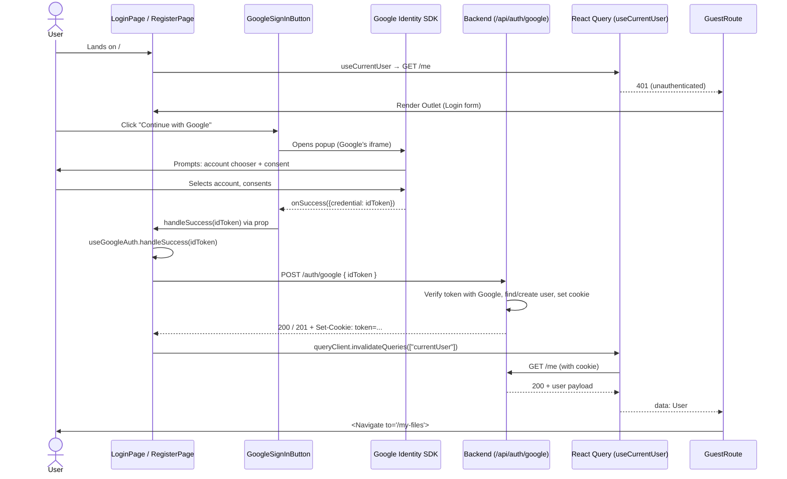
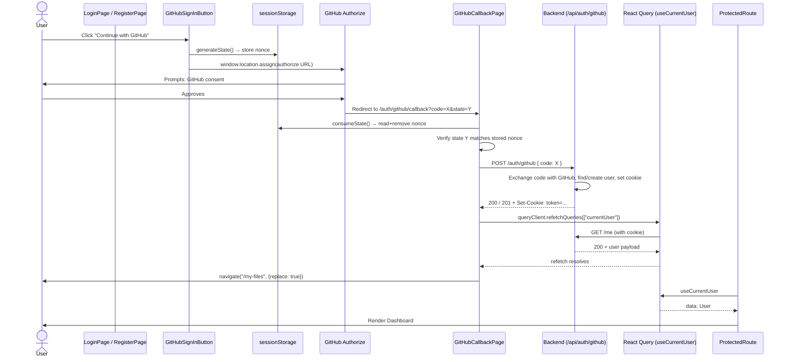

# OAuth Authentication Flow

## Table of Contents

1. [Overview](#1-overview)
2. [Shared foundation](#2-shared-foundation)
3. [Google OAuth flow](#3-google-oauth-flow)
4. [GitHub OAuth flow](#4-github-oauth-flow)
5. [Side-by-side comparison](#5-side-by-side-comparison)
6. [Design decisions for the GitHub flow](#6-design-decisions-for-the-github-flow)
7. [Edge cases and error handling](#7-edge-cases-and-error-handling)
8. [Future considerations](#8-future-considerations)
9. [Glossary](#9-glossary)

---

## 1. Overview

TroveCloud authenticates users via three paths:

| Path | Mechanism | Status |
| --- | --- | --- |
| Email + password | Form on `/` (Login) and `/create-account` (Register), `/api/auth/login` and `/api/auth/register` | ✅ Live |
| Google OAuth | Google Identity Services (popup) → ID token → `/api/auth/google` | ✅ Live (PR #29) |
| GitHub OAuth | Full-page redirect → authorization code → `/api/auth/github` | ✅ Live (PR #30) |

All three paths converge on the same outcome: **the backend sets a single `HttpOnly`, `Secure`, `SameSite=Lax` session cookie called `token`** with a 7-day TTL. The frontend never sees the cookie value; it can only know the user is authenticated by issuing `GET /api/auth/me` and seeing a 200 with the user payload.

This document covers the two OAuth paths (Google and GitHub) — what they do step-by-step, how they're wired, and why the GitHub flow looks different from the Google flow despite both being "OAuth sign-in".

---

## 2. Shared foundation

Both OAuth flows reuse the same core infrastructure. Understanding these pieces first makes the per-provider sections easier to follow.

### 2.1 Cookie-based session

- Backend sets `Set-Cookie: token=<signed-id>; HttpOnly; Secure; SameSite=Lax; Max-Age=604800` on any successful auth (login, register-verify-otp, OAuth).
- Cookie is **httpOnly** — JavaScript cannot read or write it. The only way the frontend "knows" auth state is by calling `/me`.
- Axios is configured with `withCredentials: true` so the browser sends the cookie on every API call.

### 2.2 Axios client and error normalization

- **`src/config/axiosClient.ts`** creates a single `axios` instance with `baseURL: VITE_API_URL` and `withCredentials: true`.
- A response interceptor catches 4xx/5xx responses and rejects with a normalized `ApiError` shape: `{ code: string, message: string }`. This conversion happens in **`src/lib/normalizeError.ts`**.
- Every API function in **`src/api/`** awaits `axiosClient.<method>` and returns `data` on success. Failures bubble up as `ApiError` rejections.

### 2.3 React Query for auth state

- **`src/config/queryClient.ts`** registers the global `QueryClient` with `retry: false`, `refetchOnWindowFocus: false`, and a TypeScript module-augmentation that registers `ApiError` as the default mutation/query error type.
- **`useCurrentUser`** (in `src/hooks/useAuth.ts`) is a query keyed `["currentUser"]` that hits `/me`. It uses `staleTime: Infinity` so it never refetches automatically — it only refetches when explicitly invalidated (e.g., after sign-in/out).
- **Route guards** (`src/routes/GuestRoute.tsx` and `src/routes/ProtectedRoute.tsx`) read `useCurrentUser` and decide whether to render the matched page or `<Navigate>` away.

### 2.4 Routing skeleton

`src/routes/AppRoutes.tsx` defines three buckets:

- **Guest routes** (wrapped in `<GuestRoute />` + `<AuthLayout />`): Login, Register, Forgot Password. Authenticated users get bounced to `/my-files`.
- **OAuth callback** (wrapped only in `<AuthLayout />`, **no guard**): GitHub callback. Must execute regardless of current auth state.
- **Protected routes** (wrapped in `<ProtectedRoute />` + `<DashboardLayout />`): Dashboard, Settings. Unauthenticated users get bounced to `/`.

All paths are constants in **`src/routes/paths.ts`** (`ROUTES.ROOT`, `ROUTES.GITHUB_CALLBACK`, etc.) — no string literals in JSX.

### 2.5 Error display patterns

OAuth errors land in two surfaces:

| Surface | Used for | Component |
| --- | --- | --- |
| `<AlertBanner variant="error">` above the email/password form | Provider-mismatch and email-not-verified errors that arise from the user clicking the OAuth button on Login/Register itself | `src/components/ui/alert-banner.tsx` |
| Dedicated "Sign-in failed" panel on the callback URL | GitHub-only — when the failure happens after the redirect to `/auth/github/callback` | `src/pages/GitHubCallbackPage.tsx` |

Backend codes that are safe to surface verbatim are whitelisted in each hook (`SHOWABLE_ERROR_CODES`); everything else falls through to a generic message so transport / 500 / unknown error strings never leak to the UI.

---

## 3. Google OAuth flow

Google's flow is **popup-based**: the user never leaves the Login or Register page. Google's SDK opens a popup, the user authenticates inside it, and the popup posts an ID token back via `postMessage` to the parent window — entirely inside the React tree.

### 3.1 Sequence diagram



### 3.2 Step-by-step walkthrough

**Step 1 — App boot.**
`src/main.tsx` reads `VITE_GOOGLE_CLIENT_ID` and throws at startup if it's missing. The whole React tree is wrapped in `<GoogleOAuthProvider clientId={...}>` so Google Identity Services initializes once at the root, before any `<GoogleLogin>` widget mounts.

**Step 2 — Login or Register page renders.**
`useGoogleAuth({ setError: setAuthError, onSuccess: reset })` returns `{ handleSuccess, handleError, isPending }`. The `<GoogleSignInButton onSuccess={handleSuccess} onError={handleError} />` is rendered above the email form.

**Step 3 — Button click.**
`GoogleSignInButton` is a custom-styled `<button>` with an **invisible** `<GoogleLogin>` widget overlaid on top via `position: absolute` + `opacity: 0`. The visible button captures the user's eye; the invisible widget catches the actual click and triggers Google's popup. This trick is necessary because the official `<GoogleLogin>` widget can't be styled freely — Google's SDK draws its own pixels inside an iframe.

**Step 4 — Popup, consent, ID token.**
Google opens a popup window for the user. The user picks an account and grants consent. The popup posts the result back via `postMessage` to the parent window. Google's SDK invokes the `onSuccess` callback with `{ credential: idToken }`. The popup closes.

**Step 5 — POST to backend.**
`useGoogleAuth.handleSuccess(idToken)` calls `mutate({ idToken }, { onSuccess, onError })`. The `mutate` is React Query's scoped-callback API — `onSuccess` and `onError` fire when the mutation resolves. This works reliably because we're already inside a synchronous event-handler callback, which is React Query's well-trodden path.

**Step 6 — Cookie set.**
Backend verifies the ID token with Google's certs, finds or creates the user, issues a session, and responds `Set-Cookie: token=...`. The frontend doesn't touch the cookie directly; the browser just stores it.

**Step 7 — Invalidate and redirect.**
`onSuccess` calls `queryClient.invalidateQueries({ queryKey: ["currentUser"] })`. Because `<GuestRoute />` is the active observer of `useCurrentUser` (we're still on `/`), the invalidation triggers an immediate refetch. `/me` returns the user. `GuestRoute`'s `data` prop flips from `undefined` to the user object, which causes it to render `<Navigate to={ROUTES.MY_FILES} replace />`. The user lands on the dashboard.

### 3.3 Files involved

| Stage | File | Role |
| --- | --- | --- |
| App boot | `src/main.tsx` | Validates `VITE_GOOGLE_CLIENT_ID` and wraps app in `<GoogleOAuthProvider>` |
| Type contract | `src/types/auth.types.ts` | `GoogleSignInPayload { idToken: string }` |
| API call | `src/api/auth.api.ts` | `signInWithGoogle({ idToken })` posts to `/api/auth/google` |
| Mutation hook | `src/hooks/useAuth.ts` | `useGoogleSignIn = () => useMutation({ mutationFn: signInWithGoogle })` |
| Orchestration hook | `src/hooks/useGoogleAuth.ts` | `useGoogleAuth({ setError, onSuccess })` — calls `mutate` with scoped callbacks, whitelists `PROVIDER_MISMATCH` and `GOOGLE_EMAIL_NOT_VERIFIED` for direct display, invalidates `currentUser` on success |
| UI button | `src/components/auth/GoogleSignInButton.tsx` | Custom-styled `<button>` + invisible `<GoogleLogin>` widget overlay (`absolute inset-0 opacity-0`); inline 4-color G SVG |
| Page integration | `src/pages/LoginPage.tsx`, `src/pages/RegisterPage.tsx` | Render the button above the email form, share `isPending` to disable other inputs during the flow |
| Auth state observer | `src/routes/GuestRoute.tsx` | Observes `useCurrentUser`, redirects to `/my-files` once data arrives |

### 3.4 Notable implementation details

- **`<GoogleOAuthProvider>` at the root** — Google Identity Services needs to initialize before any `<GoogleLogin>` widget mounts. The provider is hoisted to `main.tsx` so it's available across the entire React tree.
- **Invisible-overlay trick** — Google's official `<GoogleLogin>` widget renders an iframe we can't style. To get TroveCloud's visual design, we render a styled `<button>` and overlay an invisible `<GoogleLogin>` on top of it. The user sees our button; Google's SDK receives the click.
- **400 px width** — Google's iframe enforces a minimum width of about 400 px. The `width="400"` prop on `<GoogleLogin>` matches that, and the surrounding `max-w-[400px]` on the form keeps everything aligned. A responsive `<ResizeObserver>` approach was considered and rejected as over-engineering for this single edge case.
- **`group-focus-within` ring** — keyboard focus on the invisible `<GoogleLogin>` is forwarded to a focus ring on the visible wrapper via Tailwind's `group-focus-within:ring-2`. Without this, keyboard users would see no focus indicator.
- **Synchronous trigger** — `mutate(...)` is called from inside Google's `onSuccess` callback, which the SDK invokes synchronously after the popup posts back. This is React Query's intended use case for mutations, and scoped `onSuccess` / `onError` callbacks fire reliably.

---

## 4. GitHub OAuth flow

GitHub's flow is **redirect-based**: there is no JavaScript SDK. The button navigates the entire browser to `https://github.com/login/oauth/authorize?...`. After consent, GitHub redirects the browser to a registered callback URL on our domain with an authorization `code`. A dedicated callback page then exchanges that code with the backend.

### 4.1 Sequence diagram



### 4.2 Step-by-step walkthrough

**Step 1 — App boot.**
`src/main.tsx` reads both `VITE_GOOGLE_CLIENT_ID` and `VITE_GITHUB_CLIENT_ID` and throws if either is missing. There is no provider component for GitHub — the client ID is consumed lazily inside the button's click handler.

**Step 2 — Button click.**
On `GitHubSignInButton`'s `handleClick`:
1. Read `VITE_GITHUB_CLIENT_ID` from `import.meta.env`. Defensive guard returns early if missing (startup validation in `main.tsx` should have already caught this — the in-button guard is belt-and-suspenders).
2. Call `generateState()` (in `src/lib/githubOAuth.ts`), which:
   - Generates a UUID v4 nonce via `crypto.randomUUID()`.
   - Stashes it in `sessionStorage` under the key `github_oauth_state`.
   - Returns the nonce so the caller can put it in the authorize URL.
3. Build the authorize URL: `https://github.com/login/oauth/authorize?client_id=...&redirect_uri=...&scope=read:user user:email&state=...`. The `redirect_uri` is computed at runtime as `${window.location.origin}${ROUTES.GITHUB_CALLBACK}`.
4. Call `window.location.assign(url)` to **navigate the entire browser away** from the current page.

**Step 3 — GitHub consent.**
The user lands on `github.com/login/oauth/authorize`. They sign in to GitHub if not already, then see "TroveCloud is requesting access to your account" with the requested scopes. They click Authorize.

**Step 4 — Redirect back.**
GitHub redirects the browser to `${origin}/auth/github/callback?code=<auth-code>&state=<nonce>`. Both `code` (single-use, ~10-minute TTL) and `state` (the nonce we sent) come back as query parameters.

**Step 5 — Callback page mounts.**
`GitHubCallbackPage` is rendered. **Crucially, this route lives outside `<GuestRoute />`** — see [Design decision §6.2](#62-callback-route-must-execute-regardless-of-auth-state) for the rationale. The page mounts unconditionally.

**Step 6 — CSRF state verification.**
On `useEffect` (with a `useRef` guard to handle React's StrictMode double-effect):
1. Check for `?error=` — if GitHub returned an error (e.g., user clicked "Cancel"), surface a generic error and stop.
2. Read `code` and `state` from the URL.
3. Call `consumeState()` — reads the stored nonce from `sessionStorage` and removes it.
4. Compare returned `state` to stored nonce. If they don't match, abort with a generic error (CSRF defense).

**Step 7 — Code exchange.**
`useGitHubAuth.handleCode(code)` calls `await mutateAsync({ code })`. The backend:
1. POSTs the code to GitHub's `/login/oauth/access_token` to exchange it for an access token.
2. Calls GitHub's `/user` and `/user/emails` to fetch profile and verified primary email.
3. Finds or creates the TroveCloud user.
4. Issues a session cookie.

**Step 8 — Refetch `/me` BEFORE navigating.**
After `mutateAsync` resolves, `await queryClient.refetchQueries({ queryKey: ["currentUser"] })`. Awaiting matters — it ensures the `useCurrentUser` cache holds the new authenticated state before we move the user to a route guarded by `<ProtectedRoute />`. Without this await, `ProtectedRoute` would mount and read the stale 401 from app startup, bouncing the user back to `/`.

**Step 9 — Explicit navigate to `/my-files`.**
The callback page calls `navigate(ROUTES.MY_FILES, { replace: true })` (passed to `useGitHubAuth` as `onSuccess`). Because the callback is outside `GuestRoute`, the redirect is no longer implicit — we must do it ourselves.

**Step 10 — `ProtectedRoute` reads fresh state.**
`ProtectedRoute` mounts on `/my-files`, observes `useCurrentUser`, sees the user data we just refetched, and renders the dashboard.

### 4.3 Files involved

| Stage | File | Role |
| --- | --- | --- |
| App boot | `src/main.tsx` | Validates `VITE_GITHUB_CLIENT_ID` (combined with Google's check) |
| Type contract | `src/types/auth.types.ts` | `GitHubSignInPayload { code: string }` |
| API call | `src/api/auth.api.ts` | `signInWithGitHub({ code })` posts to `/api/auth/github` |
| Mutation hook | `src/hooks/useAuth.ts` | `useGitHubSignIn = () => useMutation({ mutationFn: signInWithGitHub })` |
| OAuth helpers | `src/lib/githubOAuth.ts` | `generateState`, `consumeState`, `buildAuthorizeUrl`. Owns the `sessionStorage` key (`github_oauth_state`), the scope string (`read:user user:email`), and the `redirect_uri` derivation from `window.location.origin` |
| Orchestration hook | `src/hooks/useGitHubAuth.ts` | `useGitHubAuth({ setError, onSuccess })` — uses `mutateAsync` + `try`/`catch`, awaits `refetchQueries` before calling `onSuccess`, whitelists `PROVIDER_MISMATCH` and `GITHUB_EMAIL_NOT_VERIFIED` |
| UI icon | `src/components/auth/GitHubIcon.tsx` | Inlined Octocat SVG (Lucide doesn't ship brand icons), `currentColor` for theme adaptation. Shared between the button and the callback page |
| UI button | `src/components/auth/GitHubSignInButton.tsx` | Plain `<button>` with `onClick` → state generation → `window.location.assign(buildAuthorizeUrl(...))`. Defensive missing-clientId guard |
| Callback page | `src/pages/GitHubCallbackPage.tsx` | Parses query params, verifies CSRF state, calls `handleCode`, renders loading panel (purple spinner ring + GitHub mark) or error panel (danger circle + message + "Back to sign in" button). `handledRef` guards against StrictMode double-effect |
| Routing | `src/routes/AppRoutes.tsx` | Registers `ROUTES.GITHUB_CALLBACK` as a sibling of `<GuestRoute />`, not nested inside it |
| Page integration | `src/pages/LoginPage.tsx`, `src/pages/RegisterPage.tsx` | Render the GitHub button beneath the Google button, share `isPending` |
| Path constant | `src/routes/paths.ts` | `ROUTES.GITHUB_CALLBACK = "/auth/github/callback"` |

### 4.4 Notable implementation details

- **No client-side SDK.** GitHub's OAuth is a plain redirect protocol. We construct the authorize URL ourselves via `URLSearchParams` — no third-party library is involved on the frontend.
- **CSRF state via `sessionStorage`.** `sessionStorage` is per-tab and survives the redirect-roundtrip to GitHub and back. The state is removed on first read (`consumeState` returns `null` on subsequent reads), so a double-check is impossible — defends against replay.
- **Redirect URI from `window.location.origin`.** Each environment (`http://localhost:5173`, staging URL, prod URL) registers its own origin on the GitHub OAuth app's "Authorization callback URL" allowlist. No per-env `VITE_GITHUB_REDIRECT_URI` env var is needed.
- **`handledRef` StrictMode guard.** React 18+ StrictMode in dev double-invokes effect setup. Without the ref, the single-use authorization code would be sent to the backend twice — the second attempt would fail because GitHub already invalidated the code on first exchange. The ref ensures the code is processed exactly once even with the double-effect.
- **`mutateAsync` instead of scoped callbacks.** See [Design decision §6.1](#61-mutateasync--trycatch-instead-of-scoped-mutation-callbacks).
- **Awaited `refetchQueries`.** See [Design decision §6.3](#63-await-refetchqueries-before-navigating).
- **Loading-state visual.** The page renders a 64 px purple ring with a spinning border around a static GitHub mark — matches the dimensions of the danger-tinted error circle so transitions between loading and error feel like the same component swapping content.

---

## 5. Side-by-side comparison

| Aspect | Google | GitHub |
| --- | --- | --- |
| **Trigger UX** | Popup — user stays on Login/Register | Full-page redirect — entire browser navigates away |
| **Provider library** | `@react-oauth/google` SDK + `<GoogleOAuthProvider>` context | None — we construct the authorize URL ourselves |
| **Provider credential** | ID token (JWT) returned via popup `postMessage` | Authorization code returned via URL query string |
| **CSRF defense** | Handled internally by Google's SDK (nonce baked into the ID token) | Manual — we generate and verify a state nonce in `sessionStorage` |
| **Where `mutate` fires from** | Synchronous event-handler callback (Google's `onSuccess`) | `useEffect` on the callback page after the redirect lands |
| **React Query API used** | `mutate(vars, { onSuccess, onError })` (scoped callbacks) | `await mutateAsync(vars)` inside `try` / `catch` |
| **Auth-state observer that fires the redirect** | `<GuestRoute />` reactively redirects once `useCurrentUser` data arrives | `GitHubCallbackPage` calls `navigate(ROUTES.MY_FILES, { replace: true })` explicitly |
| **Cache update** | `queryClient.invalidateQueries(["currentUser"])` (fire-and-forget) | `await queryClient.refetchQueries(["currentUser"])` (must complete before navigation) |
| **Error display** | `<AlertBanner>` above the form on Login/Register | Dedicated error panel on the callback page with "Back to sign in" button |
| **Route placement** | Login/Register stay inside `<GuestRoute />` | Callback lives **outside** `<GuestRoute />` |
| **Env vars** | `VITE_GOOGLE_CLIENT_ID` (required at startup, used by provider) | `VITE_GITHUB_CLIENT_ID` (required at startup, read in button) |
| **Redirect URI registration** | N/A (popup model) | One per environment on GitHub OAuth app, derived from `window.location.origin` |
| **Loading state** | Brief; the popup feels native to Google. Login button shows `isPending` | Multi-second; the user sees a dedicated spinner panel because the network round-trip to GitHub + backend is visible |
| **Backend endpoint** | `POST /api/auth/google` with `{ idToken }` | `POST /api/auth/github` with `{ code }` |

---

## 6. Design decisions for the GitHub flow

The GitHub flow has three deliberate divergences from the "natural" parallel of the Google flow. Each is documented below with the problem it solves and the trade-offs.

### 6.1 `mutateAsync` + `try`/`catch` instead of scoped mutation callbacks

**Problem.** The first implementation used the same React Query pattern as `useGoogleAuth`:

```ts
mutate(
  { code },
  {
    onSuccess: () => { ... },
    onError: (err) => setError(err.message),
  },
);
```

In testing, both 200 and 409 responses landed at the backend (visible in the Network tab) but neither `onSuccess` nor `onError` ever fired. The page sat on the loading spinner forever.

**Root cause.** The callback page re-renders 5+ times between calling `mutate()` and the response arriving. Each render of `useGitHubAuth` returns a new `handleCode` reference, which the callback's `useEffect` has in its dependency array — so the effect re-runs every render (short-circuited by the `handledRef` guard, but renders still happen). React Query v5's scoped callbacks attached to a single `mutate()` invocation can be lost in this churn when the call originates from a `useEffect`.

**Solution.** Switch to `mutateAsync({ code })` and resolve the success/error path via `try` / `catch`. A real `Promise` is core JavaScript — it can't be lost by React Query's mutation observer plumbing.

```ts
try {
  await mutateAsync({ code });
  await queryClient.refetchQueries({ queryKey: ["currentUser"] });
  onSuccess?.();
} catch (err) {
  // Axios interceptor guarantees ApiError shape on rejection.
  const apiErr = err as ApiError;
  setError(SHOWABLE_ERROR_CODES.has(apiErr.code) ? apiErr.message : GENERIC_ERROR_MESSAGE);
}
```

**Trade-off.** The `useGoogleAuth` and `useGitHubAuth` hooks now use different React Query patterns. The asymmetry is intentional and documented in `useGitHubAuth.ts`'s JSDoc. Aligning Google to also use `mutateAsync` was considered and rejected as unnecessary churn — Google's flow fires from a synchronous event handler where scoped callbacks work fine.

### 6.2 Callback route must execute regardless of auth state

**Problem.** Initially the callback route was nested inside `<GuestRoute />`. `GuestRoute` redirects authenticated users to `/my-files` *before* rendering the matched outlet. So if an already-authenticated user landed on `/auth/github/callback?code=...` (stale cookie, multi-tab flow, future account-linking), they'd be redirected to `/my-files` before the code was processed. The single-use code would expire on GitHub's side without ever being exchanged. The CSRF state would sit stale in `sessionStorage`.

**Root cause.** OAuth callback URLs are **transit points, not destinations.** They exist to receive a query-string payload from the identity provider and convert it into a session. Auth guards exist for *destinations* — pages a user chooses to visit — where rules like "if logged in, redirect away" make sense. Those rules don't apply to callbacks.

**Solution.** Move the callback route to its own route group, outside both `<GuestRoute />` and `<ProtectedRoute />`:

```jsx
{/* Guest routes — accessible only when NOT logged in */}
<Route element={<GuestRoute />}>
  <Route element={<AuthLayout />}>
    <Route path={ROUTES.ROOT} element={<LoginPage />} />
    {/* ... */}
  </Route>
</Route>

{/* OAuth callback — must process the auth code regardless of current auth state */}
<Route element={<AuthLayout />}>
  <Route path={ROUTES.GITHUB_CALLBACK} element={<GitHubCallbackPage />} />
</Route>
```

The callback now mounts unconditionally. CSRF state validation, code exchange, and explicit navigation handle the "what happens next" decisions inside the page itself.

**Trade-off.** Without `GuestRoute` wrapping the callback, the implicit "redirect to `/my-files` once `useCurrentUser` data flips" no longer fires. The callback page must navigate explicitly via `useGitHubAuth`'s `onSuccess` (`goToMyFiles`).

### 6.3 `await refetchQueries` before navigating

**Problem.** Once we navigate explicitly (per §6.2), there's a race condition. If the success path is:

```ts
await mutateAsync({ code });
queryClient.invalidateQueries({ queryKey: ["currentUser"] });   // fire-and-forget
onSuccess?.();   // navigate to /my-files
```

…then the navigation fires before the `/me` refetch resolves. `ProtectedRoute` mounts on `/my-files`, reads `useCurrentUser`, and sees the cached 401 from app startup (status: error, data: undefined). Its guard kicks in and redirects the user back to `/`. The user ends up at Login despite having just signed in successfully.

**Root cause.** `invalidateQueries` only triggers a refetch if there's an active observer of that query at the time. With the callback page outside `GuestRoute`, no component is observing `useCurrentUser` when the invalidation fires. The cache is marked stale but no refetch happens until the next observer (`ProtectedRoute`) mounts — and by then we've already navigated.

**Solution.** Use `refetchQueries` instead of `invalidateQueries`, and **`await`** it before calling `onSuccess`:

```ts
await mutateAsync({ code });
// Refetch /me with the freshly-set cookie BEFORE navigating, so the destination
// route's ProtectedRoute guard sees the new user state on mount instead of
// the cached 401 from app startup.
await queryClient.refetchQueries({ queryKey: ["currentUser"] });
onSuccess?.();
```

`refetchQueries` refetches regardless of observers. Awaiting it guarantees the cache holds the new authenticated state by the time `ProtectedRoute` mounts. It mounts, reads the user, renders the dashboard. No bounce.

**Trade-off.** The success path now blocks for an extra `/me` round-trip (~50–200 ms typically) before navigating. The user sees the loading spinner slightly longer. This is acceptable — the alternative (bounce-to-login flicker) is much worse UX, and "spinner stays for one extra moment" reads as "still working" to the user.

### 6.4 Other smaller decisions

- **Redirect URI from `window.location.origin`** — avoids a per-environment `VITE_GITHUB_REDIRECT_URI` env var. Each environment just registers its origin on the GitHub OAuth app. Trade-off: requires the GitHub OAuth app to have all relevant origins added; small operational cost.
- **`SHOWABLE_ERROR_CODES` whitelist** — only `PROVIDER_MISMATCH` and `GITHUB_EMAIL_NOT_VERIFIED` get their backend message surfaced verbatim. Everything else (network errors, 5xx, unknown 4xx) falls through to a generic message. Defense against unintentionally leaking transport / debug strings.
- **`useCallback` on `handleCode`** — memoizes the function reference so the callback page's `useEffect` dependency array is stable. Without it, the effect re-runs on every render (short-circuited by `handledRef` so functionally a no-op, but noisy).
- **Defensive `if (!clientId) return` in the button** — `main.tsx` already validates `VITE_GITHUB_CLIENT_ID` at startup, but the in-button guard makes the file self-explanatory and protects against future drift if startup validation is ever bypassed.
- **Dedicated `GitHubIcon` component** — extracted because the Octocat SVG appears in both the button and the loading panel of the callback page. Lucide v1 doesn't ship brand icons, so an inline SVG was needed.

---

## 7. Edge cases and error handling

### 7.1 User cancels at the provider

| Scenario | Path | Behavior |
| --- | --- | --- |
| User closes Google popup | Google | `<GoogleLogin>` fires `onError`. `useGoogleAuth.handleError` sets a generic error message. `<AlertBanner>` shown above form. |
| User clicks "Cancel" on GitHub consent | GitHub | GitHub redirects to `/auth/github/callback?error=access_denied`. `GitHubCallbackPage` checks `params.get("error")` first; if present, sets generic error. Error panel shown with "Back to sign in" link. |

### 7.2 Backend errors

| Code | HTTP | Surface | Display |
| --- | --- | --- | --- |
| `INVALID_ID_TOKEN` (Google) | 400 | Login/Register `<AlertBanner>` | Generic message — not whitelisted |
| `GOOGLE_EMAIL_NOT_VERIFIED` | 400 | Login/Register `<AlertBanner>` | Backend message verbatim (whitelisted) |
| `INVALID_GITHUB_CODE` | 400 | Callback page error panel | Generic message — not whitelisted (this is usually a programmer error or a stale URL) |
| `GITHUB_EMAIL_NOT_VERIFIED` | 400 | Callback page error panel | Backend message verbatim (whitelisted) |
| `PROVIDER_MISMATCH` (both) | 409 | Provider's normal surface | Backend message verbatim — e.g., "This email is registered with google. Please sign in using that method." |
| Network / 5xx | — | Provider's normal surface | Generic provider-failed message |

### 7.3 Stale or tampered URLs

| Scenario | Behavior |
| --- | --- |
| User visits `/auth/github/callback` directly with no params | `consumeState()` returns `null`, validation fails, generic error |
| User opens a bookmarked callback URL after `sessionStorage` has been cleared | Same as above — generic error |
| Attacker phishes a victim with a forged callback URL | Forged `state` won't match the victim's stored nonce. Validation fails, error shown, no API call made |
| User reloads `/auth/github/callback` after a successful sign-in | `consumeState()` returns `null` (already consumed), generic error shown briefly. Clicking "Back to sign in" routes the user to `/`, where `<GuestRoute />` notices they're authenticated and bounces to `/my-files` |

### 7.4 React StrictMode

Both flows have to handle React 18+ StrictMode's deliberate double-invocation of effect setup in development:

| Concern | How it's handled |
| --- | --- |
| Double `mutate` from a `useEffect`-triggered call | `handledRef` in `GitHubCallbackPage` ensures only the first effect run reaches `handleCode` |
| Double `consumeState` removing/re-reading | `handledRef` short-circuits before `consumeState` is reached on the second pass |
| Double-mount risk for the popup-based Google flow | Not an issue — `mutate` fires from a synchronous user-event handler, not from an effect |

### 7.5 Already-authenticated user revisits a callback URL

This is the scenario that caused the route-placement decision in §6.2. With the callback now outside `GuestRoute`:

- The page mounts, reads `code` and `state`.
- If the URL has fresh params, the backend exchanges the code (it doesn't care about the existing session — a fresh sign-in always re-issues the cookie).
- After the exchange, the user is navigated to `/my-files`. They end up where they expected.
- If the URL has stale params, the generic error is shown. Clicking "Back to sign in" lets `GuestRoute` redirect them to `/my-files`.

### 7.6 Multi-tab

`sessionStorage` is per-tab in browsers. Two simultaneous OAuth flows in two tabs each have their own state nonce — no cross-contamination. (Two flows in the *same* tab — i.e., starting a second flow before the first redirects — would overwrite the nonce, but that's an edge case that's effectively impossible because the first flow leaves the page entirely.)

---

## 8. Future considerations

- **Account linking.** Letting an authenticated user link a Google or GitHub identity to an existing email/password account. Requires a new authenticated endpoint (`POST /api/auth/link/google`, etc.) and a new entry point from Settings. The current callback route placement (outside auth guards) is already compatible with this — an authenticated user can land on the callback and have it process correctly.
- **Logout handling on stale cookies.** If a user's cookie is invalid but the cached `useCurrentUser` is still populated, they could attempt OAuth and get a `PROVIDER_MISMATCH` for an account they don't actually have access to. Adding a "verify-then-clear-cache" step on logout would close this gap.
- **Additional providers.** Microsoft, Apple, Facebook, etc. would follow whichever pattern fits their SDK situation — popup-flow providers slot into the Google template, redirect-flow providers slot into the GitHub template. The OAuth helpers in `src/lib/githubOAuth.ts` could be generalized into a shared `src/lib/oauthState.ts` if a third redirect-flow provider is added.
- **Failing-provider button outline.** Login error state #06 (per `tasks/redesign-tasks.md`) calls for the failing OAuth button to be outlined red after a provider failure. The current implementation doesn't track which provider failed in the `authError` state shape — adding this would require widening `string | null` to `{ message: string; provider?: "google" | "github" }`.

---

## 9. Glossary

| Term | Meaning |
| --- | --- |
| **Authorization code** | A one-time, short-lived (≈10 min) value GitHub returns to the redirect URI. The backend exchanges it for an access token. Single-use — consumed on first exchange. |
| **ID token** | A signed JWT Google returns to the popup containing identity claims. The backend verifies the signature against Google's public keys and reads claims like `email` and `email_verified` directly. |
| **State (nonce)** | A random opaque value the OAuth client (us) sends to the provider and expects back unchanged. Used to defend against CSRF — prevents an attacker from tricking a victim into completing an OAuth flow the attacker started. |
| **Scope** | The permissions the OAuth client requests. Our GitHub flow requests `read:user user:email` — the minimum needed to read the user's basic profile and verified primary email. |
| **Redirect URI** | The URL the provider redirects the user to after consent. Must be registered in advance on the provider's OAuth app config. We register one per deployment environment. |
| **Provider mismatch** | A backend-emitted error code (`PROVIDER_MISMATCH`, HTTP 409) returned when the email associated with the OAuth identity is already registered under a different provider in TroveCloud. The backend's message names the existing provider so the user knows where to sign in. |
| **`HttpOnly` cookie** | A cookie flag that prevents JavaScript from reading the cookie value via `document.cookie`. Reduces the impact of XSS by making session tokens unreadable to compromised scripts. |
| **`SameSite=Lax`** | A cookie attribute that prevents the cookie from being sent on cross-site subrequests (e.g., images, iframes) but allows it on top-level navigations. Mitigates CSRF for state-changing GET requests. |

---

**Last updated:** 2026-04-29 (after PR #30 — GitHub OAuth ship).
